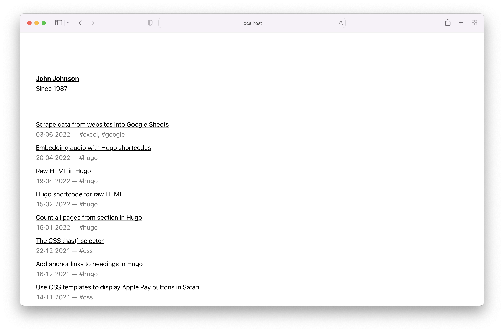
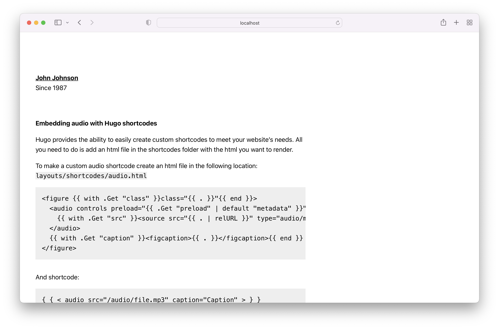

# Simplist Hugo theme

Simplist is content focused, minimal theme for Hugo. The theme is perfectly suitable for writers.

Demo: [https://simplist-hugo.netlify.app/](https://simplist-hugo.netlify.app/)

### Features

- Minimalistic, clean and simple design
- Perfect for writers
- Content focused
- System fonts
- Anchor links
- NO JS!
- AAA, 100/100 scores on Lighthouse, Gmetrix and Webpagetest
- Responsive design
- Tags and tag pages
- Inline CSS
- Atom feed
- Json feed
- Related content (internal links)
- Sass
- SEO optimized (Twitter cards, Facebook Open Graph, Schema.org)